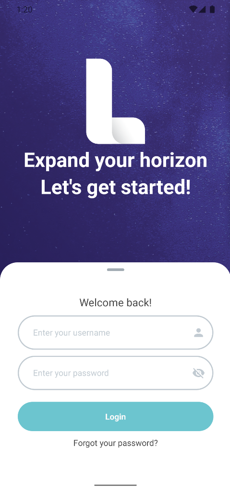
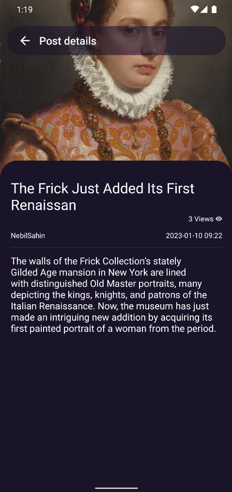
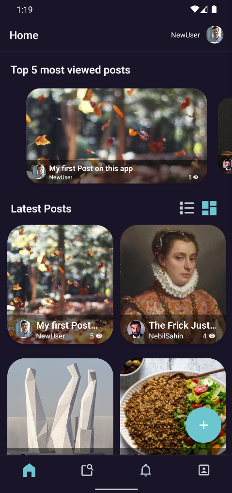
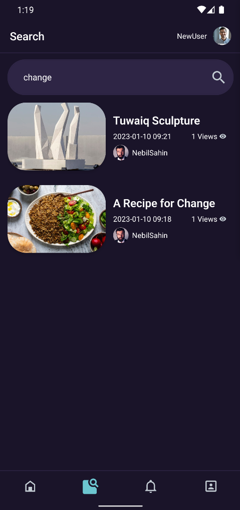
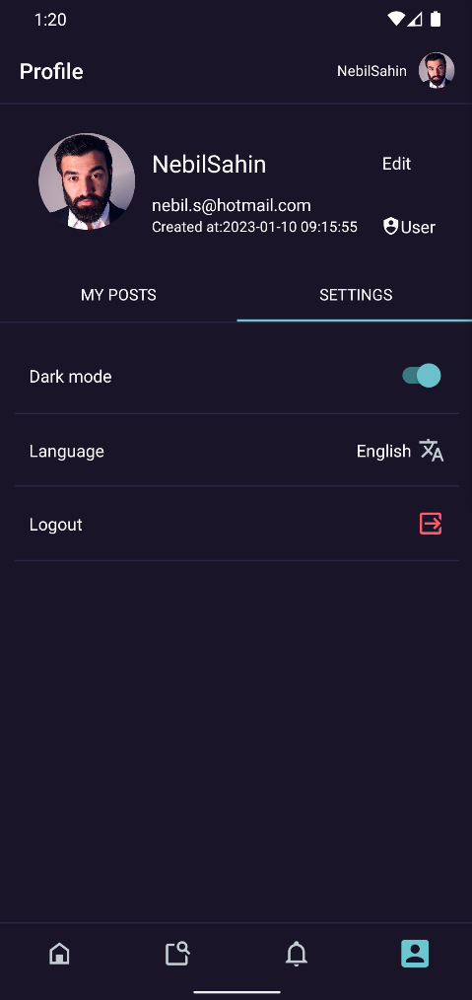
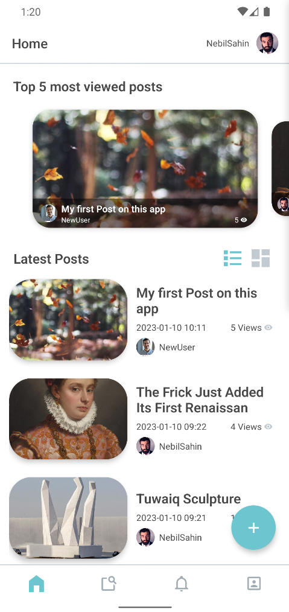
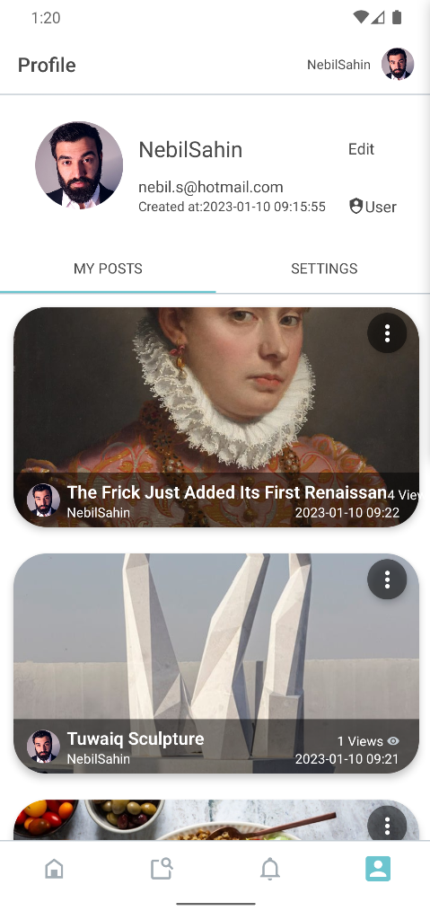

    
    <h1>
        LUYTEN
    </h1>

<strong>Luyten</strong> Is a general purpose <strong>React-Native</strong> app with the backend being <strong>Laravel</strong>. It is meant as an app to post and share articles with other people. This app's main focus is the feel and the functionality of it and was built as a practice app.

- Post articles with other users and view them.
- View your profile and the posts that you have created
- Easily update & view your account details.
- Multi-language (En & Ar).
- Dark theme support.
- Search for any article you are interested in.

### Table of Contents
* [Demo](#demo)
* [Screenshots](#screenshots)
* [Getting Started](#getting-started)
* [Todo](#todo)

## Demo

    <h3>
        <a href="./demo/Demo.webm?raw=true">Demo Video</a>
    </h3>

## Screenshots

    
    
    
    

    
    
    
    

## Getting Started
### Installition
For Installing the two main components of this app which are <strong>React-native</strong> and <strong>Laravel</strong> follow te instruction on their respective official documentation:
*   <a href="https://laravel.com/docs/9.x/installation">Laravel Installation</a>
*   <a href="https://reactnative.dev/docs/environment-setup">React-Native Installation</a>

### Running the app
Before starting, make sure of the following: 
* Chenge the API path in `/mobile/src/shared/constant.jsx` to your local ip. use `ipconfig` for windows, and `ifconfig` for Linux to get your local ip.
* Setup, migrate, and seed the database in the project root folder for Laravel `cd Luyten`.

1. Install Laravel dependencies by running `composer install` in te root folder.
2. Install React-Native dependencies by running `cd mobile` then `npm i`.
3. To run a local dev. server `cd ..` to the root folder then `php artisan serve --host=0.0.0.0 --port=8080`
4. Next `cd mobile` then `npx react-native run-android` or `npx react-native run-ios` (make sure that your emulator is running).

## Todo
* Implement notification system (the screen is there but no functionality for now).
* Add comments, likes, favorites to the posts.
* implement a chatting functionality.
